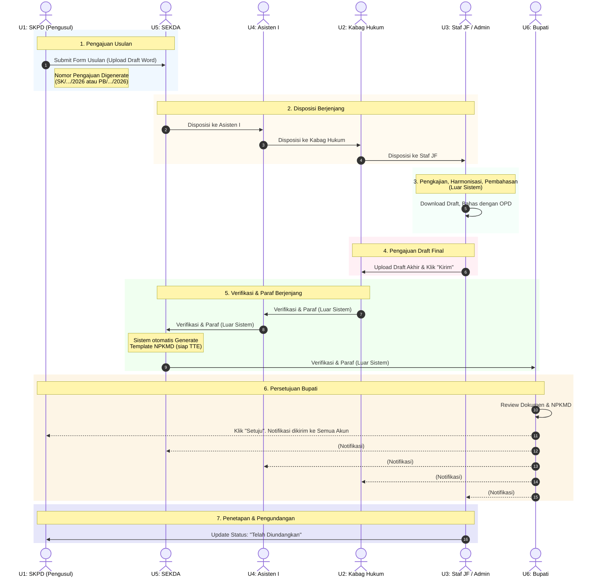
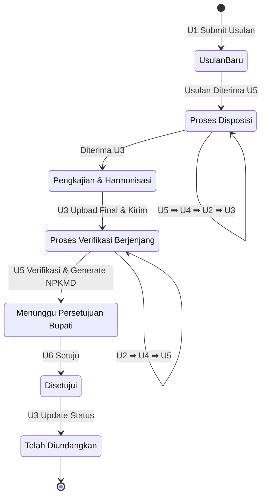

# Business Flow & Proses Bisnis SIMPUL MERAH

Dokumen ini menjelaskan secara rinci alur bisnis (business flow) pada aplikasi **SIMPUL MERAH** (Sistem Informasi Pengusulan Produk Hukum Daerah), mulai dari pengajuan usulan oleh SKPD hingga penetapan dan pengundangan produk hukum.

## 1. Aktor & Peran Pengguna

Aplikasi SIMPUL MERAH memiliki 6 peran pengguna utama, masing-masing dengan fungsi spesifik dalam alur pengusulan:

| Kode | Peran Pengguna | Fungsi dalam Sistem |
| :--- | :--- | :--- |
| **U1** | **User SKPD** (Pengusul) | Mengisi formulir usulan penyusunan produk hukum daerah (Perbup/SK) dan melampirkan dokumen draft usulan (format Word). |
| **U2** | **Super Admin** (Kepala Bagian Hukum) | Menerima disposisi, mendelegasikan tugas (disposisi ke Staf JF), dan memverifikasi draft produk hukum hasil kajian. |
| **U3** | **Admin** (Staf JF Penyusun Perundang-undangan) | Melakukan pengecekan dokumen, pengkajian, harmonisasi (proses luar sistem), mengunggah draft akhir, dan mengupdate status menjadi "Telah Diundangkan". |
| **U4** | **Asisten I** | Menerima disposisi dari SEKDA, meneruskan disposisi ke Kepala Bagian Hukum, dan memverifikasi draft produk hukum. |
| **U5** | **SEKDA** (Sekretaris Daerah) | Memeriksa usulan masuk pertama kali, mendelegasikan disposisi ke Asisten I, memverifikasi draft akhir, dan me-trigger *generate* otomatis template NPKMD. |
| **U6** | **Bupati** | Memberikan persetujuan akhir usulan produk hukum di dalam sistem. |

---

## 2. Alur Makro

Secara umum, proses pembentukan produk hukum melalui tahapan berikut:
1. Penyampaian Usulan dari SKPD kepada Bagian Hukum.
2. Pemeriksaan kelengkapan dokumen.
3. Pengkajian dan Harmonisasi (Analisis hukum, Sinkronisasi, Harmonisasi, dan Penyempurnaan substansi).
4. Pembahasan yang melibatkan Perangkat Daerah pengusul, Bagian Hukum, dan Instansi terkait.
5. Persetujuan secara berjenjang.
6. Penetapan oleh Bupati.
7. Pengundangan.

---

## 3. Alur Mikro di Dalam Aplikasi SIMPUL MERAH

Alur operasional secara rinci pada sistem aplikasi dijabarkan dalam tahapan berikut:

### **Tahap 1: Pengusulan Produk Hukum**
- **Aktor:** `U1` (User SKPD)
- **Aksi:** Login dan mengisi formulir Mengusulkan Penyusunan Produk Hukum, menentukan jenis usulan (SK/Perbup), dan mengunggah dokumen draf awal (wajib berekstensi Word `.doc`/`.docx`).
- **Output:** Nomor pengajuan diterbitkan (Contoh: `SK/1/2026` atau `PB/1/2026`). Usulan terkirim dan muncul di *dashboard* `U5` (SEKDA). Secara informasional masuk juga di akun `U2` dan `U6`.

### **Tahap 2: Proses Disposisi Berjenjang (Turun)**
- **Aktor:** `U5`, `U4`, `U2`
- **Langkah:**
  1. **Disposisi U5 ke U4:** `U5` (SEKDA) memeriksa usulan yang masuk dan melakukan instruksi disposisi (sesuai template gambar/format yang disepakati) ke `U4` (Asisten I).
  2. **Disposisi U4 ke U2:** Disposisi masuk ke halaman `U4`. `U4` meneruskan disposisi tersebut ke `U2` (Kepala Bagian Hukum).
  3. **Disposisi U2 ke U3:** Disposisi masuk ke halaman `U2`. `U2` mendelegasikan/mendisposisikan tugas ke `U3` (Staf JF).

### **Tahap 3: Pengkajian, Harmonisasi, dan Pembahasan (Hybrid)**
- **Aktor:** `U3` (Admin / Staf JF)
- **Aksi (Dalam Sistem):** Mengecek dan mengunduh (*download*) dokumen usulan dari SKPD.
- **Aksi (Luar Sistem):** Melakukan proses pengkajian, sinkronisasi, harmonisasi, dan pembahasan dengan SKPD pengusul dan pihak terkait lainnya.

### **Tahap 4: Pengunggahan Draf Akhir dan Permohonan Verifikasi**
- **Aktor:** `U3` (Admin / Staf JF)
- **Aksi:** Mengunggah draf produk hukum yang sudah final (hasil kajian & harmonisasi) ke aplikasi. Kemudian, klik tombol **"Kirim"** untuk menyerahkan draf ke `U2` (Kepala Bagian Hukum) untuk diverifikasi.

### **Tahap 5: Proses Verifikasi Berjenjang (Naik)**
Proses persetujuan (verifikasi) akan naik secara berjenjang dengan proses paraf yang dilakukan secara paralel di luar sistem.
- **Aktor:** `U2`, `U4`, `U5`
- **Langkah:**
  1. **Verifikasi U2:** `U2` (Kabag Hukum) mereview dokumen. Jika sesuai, melakukan paraf (luar sistem) dan klik **"Verifikasi"** (di sistem). Dokumen diteruskan ke `U4`.
  2. **Verifikasi U4:** `U4` (Asisten I) mereview dokumen. Jika sesuai, melakukan paraf (luar sistem) dan klik **"Verifikasi"** (di sistem). Dokumen diteruskan ke `U5`.
  3. **Verifikasi U5 & Generate NPKMD:** `U5` (SEKDA) mereview dokumen. Jika sesuai, melakukan paraf (luar sistem) dan klik **"Verifikasi"** (di sistem).
     - *Catatan Penting:* Saat `U5` klik verifikasi, sistem akan **meng-generate otomatis** template NPKMD (Nota Pengajuan Keputusan/Peraturan) yang siap untuk Tanda Tangan Elektronik (TTE) sesuai data usulan. Usulan kemudian diteruskan ke akun `U6`.

### **Tahap 6: Persetujuan Akhir oleh Bupati**
- **Aktor:** `U6` (Bupati)
- **Aksi:** Login ke aplikasi, mereview usulan beserta draf dan NPKMD. Jika disetujui, `U6` klik tombol **"Setuju"** di dalam sistem.
- **Output:** Status usulan berubah menjadi disetujui / usulan selesai. Aplikasi akan mengirimkan pemberitahuan (informasi progres) secara seketika (*real-time*) ke seluruh akun (U1 s.d U6).

### **Tahap 7: Penetapan dan Pengundangan (Finalisasi Status)**
- **Aktor:** Pihak berwenang (Luar Sistem), `U3` (Dalam Sistem)
- **Aksi (Luar Sistem):** Proses penandatanganan penetapan oleh Bupati dan pengundangan produk hukum (berupa nomor produk hukum terdaftar).
- **Aksi (Dalam Sistem):** `U3` (Admin) login ke aplikasi untuk meng-update status akhir usulan menjadi **"Telah Diundangkan"** (sekaligus melengkapi metadata nomor/tahun SK/Perbup final bila ada).

---

## 4. Diagram Alir Bisnis (Business Flow Diagram)

Berikut ini adalah representasi visual dari alur aplikasi menggunakan diagram Mermaid (Sequence Diagram):

### Diagram State Flow Usulan (Status Dokumen)

